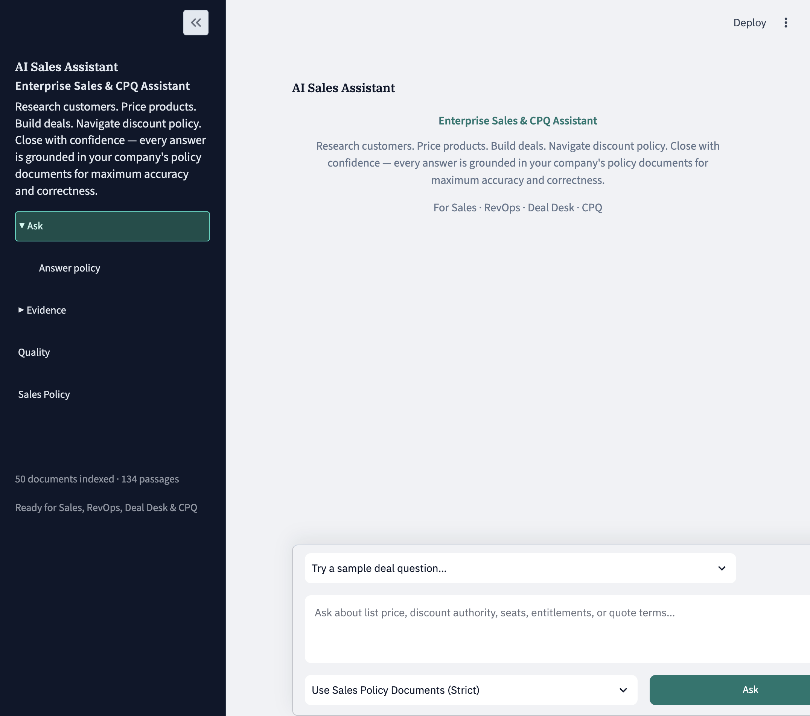
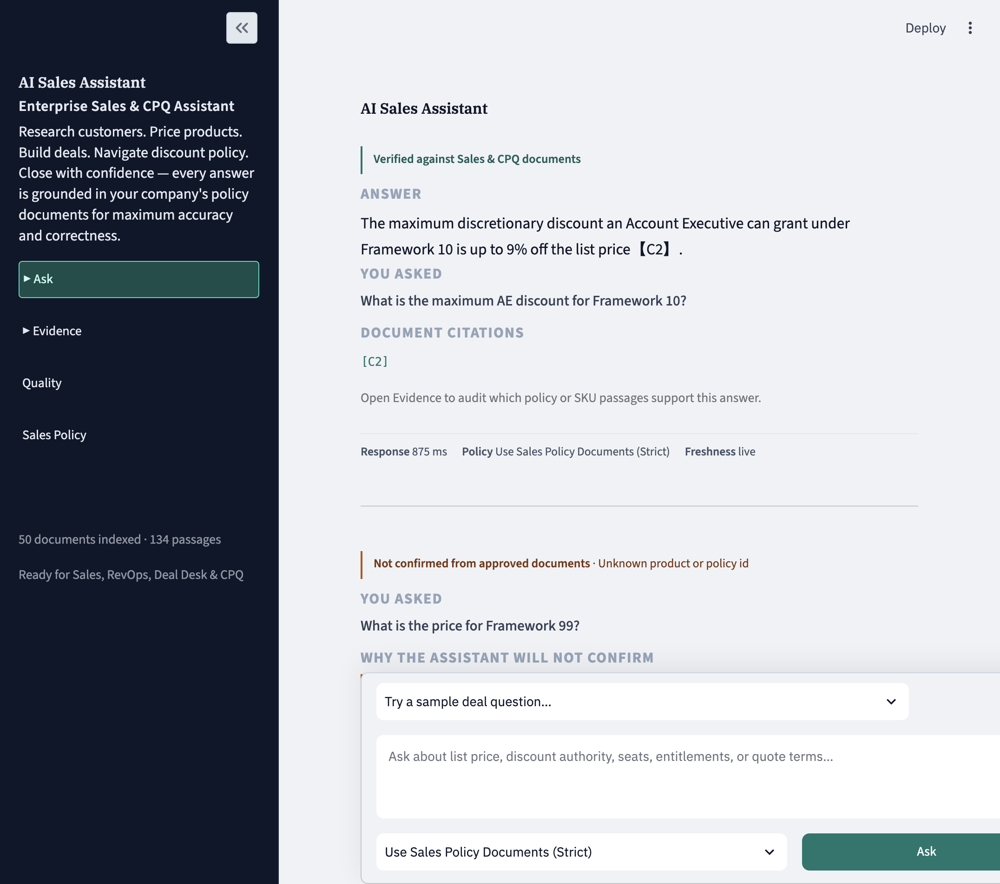
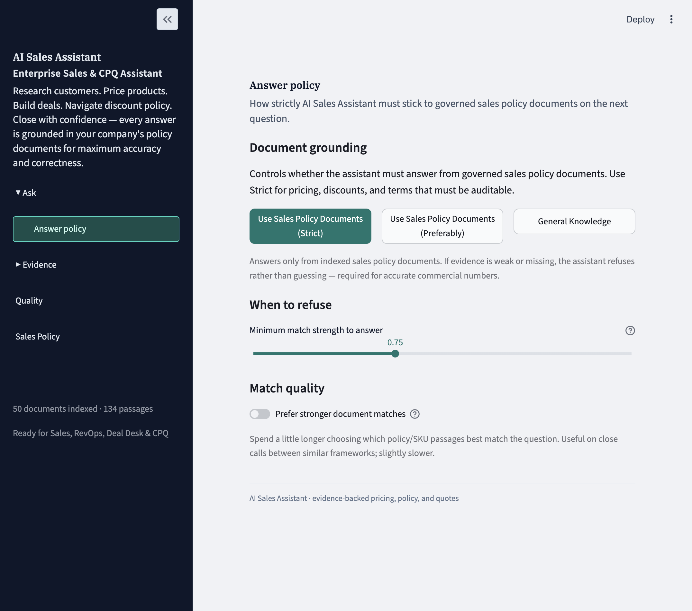
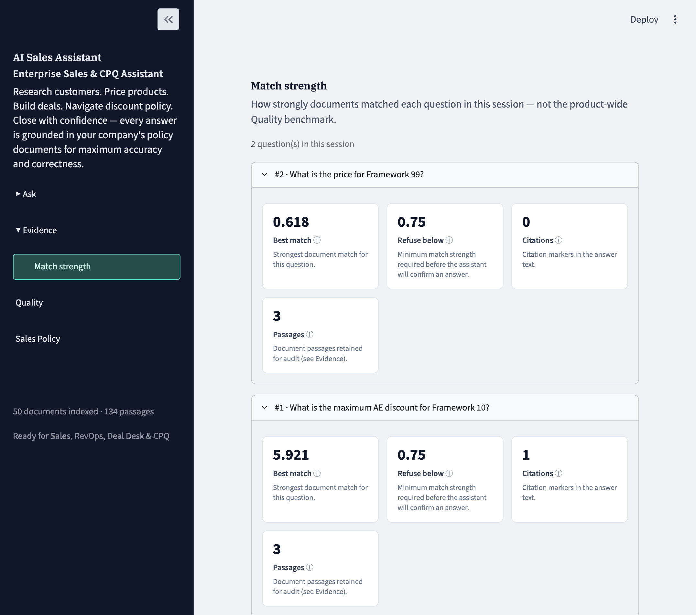

# AI Sales Assistant

**Enterprise Sales & CPQ Assistant** — answers pricing, discount authority, SLA, and deal-policy questions **only when governed documents support them**. Wrong commercial numbers are worse than no answer.

> **Demo corpus:** synthetic 50-document Sales & CPQ knowledge base — not a real customer’s commercial data.  
> **Branch for this product build:** [`atlasiq-v1`](https://github.com/sourabhde/enterprise-smart-rag/tree/atlasiq-v1)

---

## Showcase

Walkthrough (Ask → Answer policy → grounded answer → Match strength → abstention → Evidence → Quality → Sales Policy):



### Correct answer (grounded)

Framework 10 AE discount → **9%** with citation.



### Abstention (refuse to guess)

Unknown Framework 99 is not confirmed from approved documents.


### Answer policy

Strict / Preferably / General Knowledge, plus minimum match strength to answer.



### Match strength

Strong match (Framework 10) answers; weak match (Framework 99) stays below the refuse threshold.



### More screens

| File | Shows |
|------|--------|
| [`01-ask-landing.png`](demo_assets/01-ask-landing.png) | Ask home / sample questions |
| [`04-evidence.png`](demo_assets/04-evidence.png) | Evidence audit trail |
| [`05-quality.png`](demo_assets/05-quality.png) | Offline Quality metrics |
| [`06-sales-policy.png`](demo_assets/06-sales-policy.png) | Sales Policy corpus index |

Full set: [`demo_assets/`](demo_assets/).

---

## Why this product

Sales, RevOps, Deal Desk, and CPQ teams need accurate answers on:

- list price and seat entitlements  
- AE / manager discount authority  
- SLA and quote terms  

Generic LLMs sound confident even when inventing numbers. This assistant is built so that **if evidence is weak or missing, it abstains** — and shows *why*.

---

## What V1 includes

- Hybrid retrieval over a synthetic SKU / policy / SLA corpus  
- Evidence threshold gate + entity / unsupported / underspecified abstention  
- Grounded generation via Groq (default model configurable)  
- Citations + Evidence audit trail + Match strength per question  
- Answer policy controls (Strict / Preferably / General Knowledge)  
- Offline Quality page from allowlisted eval artifacts  
- Optional password gate for hosted demos  
- Answer cache + TTL so repeated demo questions stay cheap  

---

## Product surfaces

| Surface | Purpose |
|---------|---------|
| **Ask** | Question → answer or abstain → citations |
| **Answer policy** | How strictly to stick to Sales Policy documents |
| **Evidence** | Which passages were retrieved / cited |
| **Match strength** | Best match vs refuse threshold for this session |
| **Quality** | Offline benchmark metrics |
| **Sales Policy** | Corpus index + synthetic-data disclaimer |

---

## Run locally

```bash
git clone https://github.com/sourabhde/enterprise-smart-rag.git
cd enterprise-smart-rag
git checkout atlasiq-v1

python3 -m venv .venv
source .venv/bin/activate
pip install -r requirements.txt

cp .env.example .env
# Edit .env — set GROQ_API_KEY=...  (never commit .env)

python3 scripts/index_corpus.py
# Optional first-time model warm-up:
# python3 scripts/warm_models.py

streamlit run app.py
```

Local demo login (when no app password is configured): username `demo` / password `demo`.

---

## Evaluation (offline)

Authoritative clean artifacts (checked into git):

- `eval_results/run_v1_clean_full.json`
- `eval_results/run_phase8_challenge_clean_v3.json`

```bash
python3 run_eval.py --skip-judge --output eval_results/run_v1_clean_full.json
```

---

## Hosted demo (optional)

**Do not expose Streamlit on the public internet without a password.**

```bash
export GROQ_API_KEY=...
export ATLASIQ_APP_PASSWORD='choose-a-strong-password'
export ATLASIQ_REQUIRE_AUTH=1
docker compose up --build
```

Or copy `.streamlit/secrets.toml.example` → `.streamlit/secrets.toml` (gitignored) and set `password`.

---

## Safety / what is *not* in this repo

Screened before publish:

- **No** real `GROQ_API_KEY` or other API secrets (only empty placeholders in `.env.example`)  
- **No** `.env` or `.streamlit/secrets.toml` (gitignored)  
- **No** local vector DB dumps (`chroma_db/` gitignored)  
- **No** personal customer data — corpus is synthetic demo content  
- Screenshots/GIF show product UI only (no keys, no private emails)

If you fork this project: keep secrets in env / Streamlit secrets, never in git.
